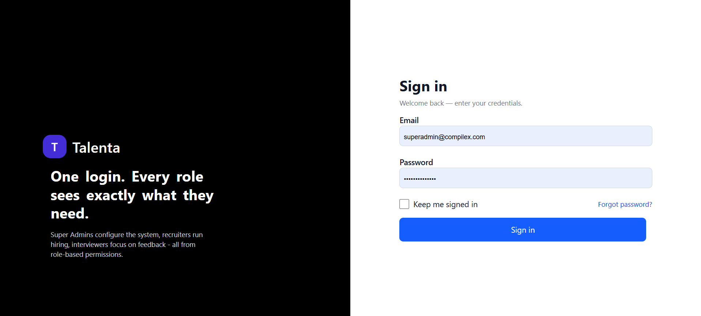
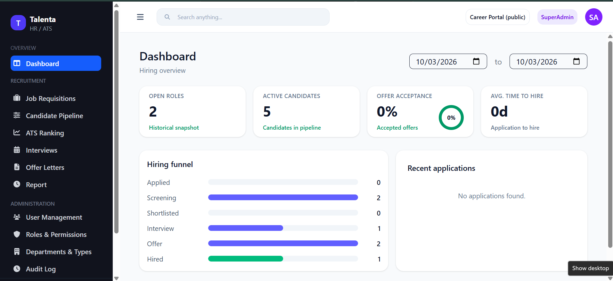
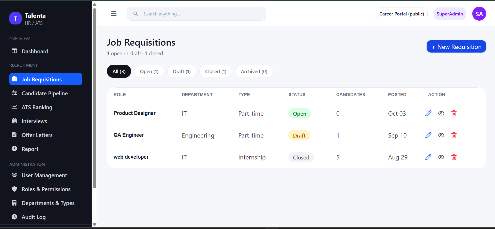
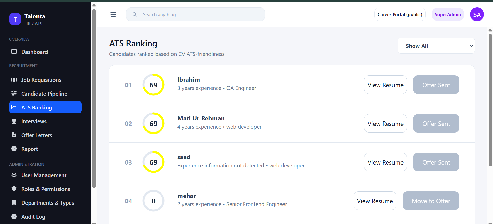
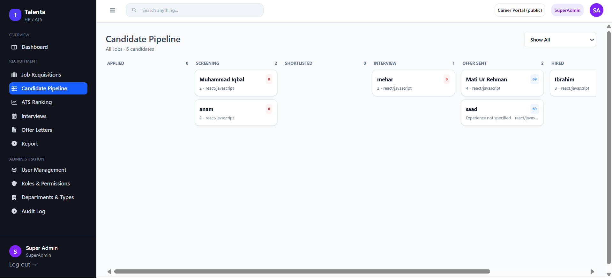
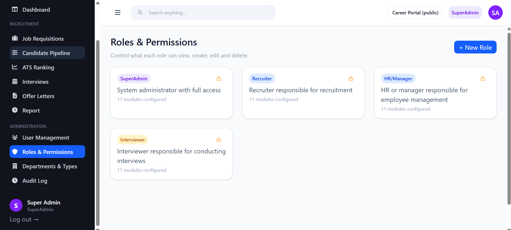
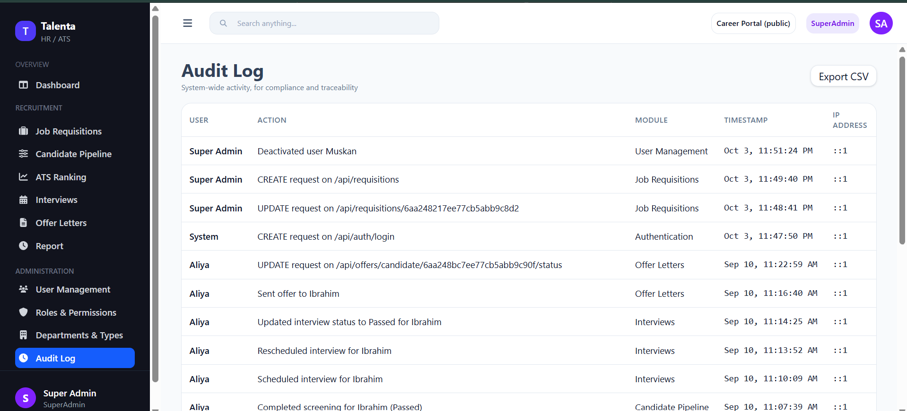
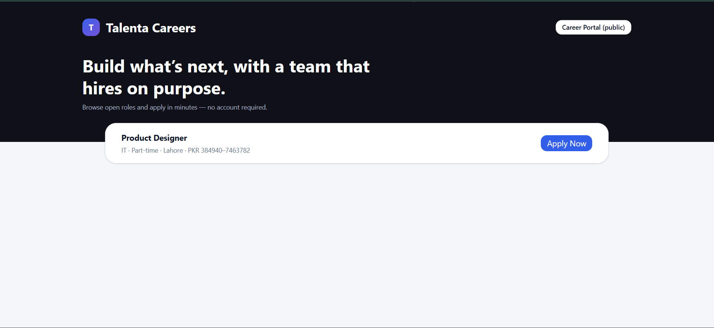

# Talenta – HR & Applicant Tracking System

Talenta is a full-stack Human Resources and Applicant Tracking System (ATS) designed to help HR teams manage recruitment from job requisitions to candidate selection.

The system provides role-based access, candidate management, ATS ranking, recruitment pipelines, interviews, offer management, dashboards, audit logs, and a career portal in one platform.

## ✨ Features

- User authentication and secure login
- Role-based access control (RBAC)
- Job requisition management
- Candidate management
- Application management
- ATS-based candidate ranking
- Candidate pipeline tracking
- Interview scheduling and management
- Interview feedback
- Offer letter management
- HR dashboards and analytics
- Recruitment reports and insights
- Career portal for job applications
- Resume/CV upload
- Email notifications
- Audit log for tracking system activities
- Protected routes and secure API access

## 👥 User Roles

Talenta supports multiple user roles with different permissions:

- **Super Admin** – System administration and overall access
- **Recruiter** – Recruitment and candidate management
- **HR Manager** – HR operations and recruitment oversight
- **Interviewer** – Interview and candidate evaluation

Permissions are controlled based on the user's role and responsibilities.

## 🛠️ Tech Stack

### Frontend

- React.js
- React Router
- Vite
- Axios
- Tailwind CSS
- React Hook Form
- React Icons / Lucide
- Sonner / React Hot Toast

### Backend

- Node.js
- Express.js
- MongoDB
- Mongoose
- JWT Authentication
- bcryptjs
- Multer
- Nodemailer

### Additional Technologies

- Cloudinary
- REST APIs
- Role-Based Access Control
- Secure API middleware
- File upload handling
- Email integration

## 📸 Screenshots

### Login



### Dashboard



### Job Requisitions



### ATS Ranking



### Candidate Pipeline



### Roles & Permissions



### Audit Log



### Career Portal



## 📁 Project Structure

```text
talenta-hr-ats-system/
│
├── hr-ats-system-be/
│   ├── controllers/
│   ├── models/
│   ├── routes/
│   ├── middleware/
│   └── ...
│
├── hr-ats-system-fe/
│   ├── src/
│   ├── pages/
│   ├── components/
│   └── ...
│
├── screenshots/
│   ├── login.png
│   ├── dashboard.png
│   ├── job-requisitions.png
│   ├── ats-ranking.png
│   ├── candidate-pipeline.png
│   ├── roles-and-permissions.png
│   ├── audit-log.png
│   └── career-portal.png
│
└── README.md